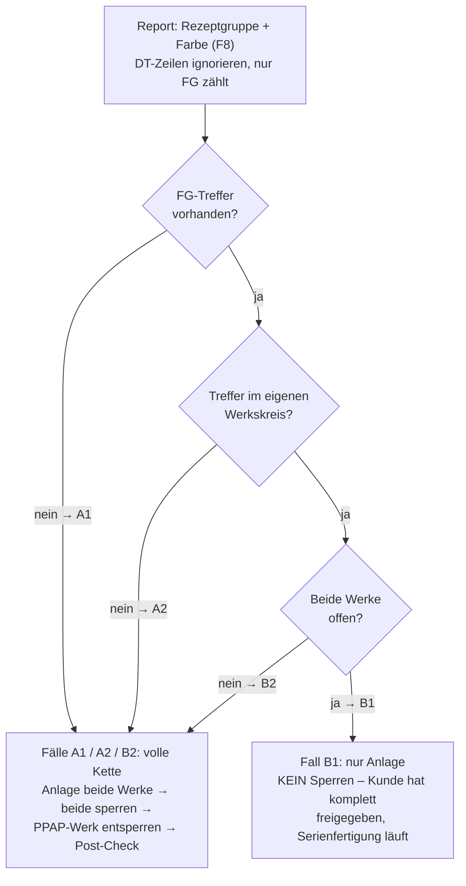

# SAP-RPA Material-Automation

Automatisierte Anlage von Artikel-Farb-Kombinationen (Fertigware + Farbzwirn)
nach realem Vorbild aus der SAP-Stammdatenpflege eines Fertigungsunternehmens
(Textil/Garn). UiPath übernimmt die UI-Automatisierung, Python die Validierung
und Orchestrierung – entwickelt gegen ein selbst gebautes Mock-System, da kein
privater SAP-Zugriff besteht.

> **Status: in aktiver Entwicklung.** Das Mock-System (5 Masken + zentrale
> Statusdatei) ist fertig und manuell durchspielbar – alle vier
> Entscheidungspfade wurden Ende-zu-Ende von Hand durchgespielt, bevor eine
> Zeile Bot-Code entsteht. Python-Schicht, UiPath-Workflows und Watchdog
> folgen – siehe [Roadmap](#roadmap).

## Begriffe (wichtig fürs Verständnis)

- **Artikel** = der Stamm ohne Farbe (z. B. `1234`). Die Meterlänge steckt
  bereits im Artikel: dieselbe Marke in anderer Länge ist ein **anderer
  Artikel** mit eigener Nummer.
- **Material** = Artikel **+** Farbe (z. B. `1234-0100Z`) – das, was SAP
  tatsächlich anlegt und was gesperrt wird.
- **FG / DT** = Fertigware / Farbzwirn. Gefärbt wird der DT (Großspule);
  die Fertigungsversion der FG schneidet davon eine Menge X ab und wickelt
  sie auf die Verkaufsspule. Je Farbe entsteht ein FG/DT-Paar.
- **Rezeptgruppe** = hängt am Artikel und bündelt alles, was sich gleich
  färben lässt (siehe unten – der Schlüssel zur Entscheidungslogik).
- **Automotive-Kennzeichen**: Farben mit Buchstaben-Suffix (`0100Z`) sind
  Automotive-/PPAP-Farben und existieren immer als Werkspaar
  (Standardwerk + PPAP-Werk). Im CDE steht dann das PPAP-Werk als
  Produktionswerk.

## Das reale Umfeld

Die Stammdatenlandschaft umfasst Materialsätze **im Millionenbereich**,
gepflegt über zahlreiche kundeneigene Z-Transaktionen. Neue Farben werden
einzeln oder – bei neuen Farbserien – **in Masse** über eine
Vorlagen-Transaktion angelegt: Ein Template-Material wird geladen, die
gewünschten Farben werden eingetragen, und das System kopiert daraus je Farbe
die komplette Struktur – FG, DT, Stücklisten, Fertigungsversionen, in zwei
Werken (Standardwerk + PPAP-Werk für die Kundenbemusterung).

**Die Stammdatenanlage läuft ausschließlich über die Zentrale** – die
Bemusterung selbst findet in den Werken statt, aber angelegt und
qualifiziert werden die Materialstämme zentral. Die Werke weltweit (u. a.
in Asien) warten dadurch auf die Arbeitszeit der Zentrale: Zeitverschiebung
wird zum Engpass. Ein Bot, der diese Kette abarbeitet, arbeitet
zeitzonenunabhängig – die Werke müssen nicht mehr auf den europäischen
Morgen warten.

### Drei reale Fehlerquellen, die dieses Projekt adressiert

1. **Die Enter-Falle.** Die Massenanlage-Transaktion lädt beim Start bereits
   ein Vorlagematerial aus der gespeicherten Variante. Wer sein eigenes
   Template oben einträgt, aber Enter vergisst, kopiert unbemerkt von der
   alten Vorlage – das Feld oben *sieht* korrekt aus, die Daten darunter
   sind es nicht. Die Folgen: falsche Gewichte, falsches PRICE-Material im
   Vertrieb, falsches APO-Material, falsche Verkaufsmengeneinheiten, falsche
   Stücklisten und Fertigungsversionen, falsche Texte – und das je Farbe.
   Passiert es bei einer Massenanlage mit vielen Farben, ist die Korrektur
   tagelange Handarbeit quer durch mehrere Module.
2. **Falscher Vorlagentyp.** Die Endziffer der Produkthierarchie kennzeichnet
   den Färbetyp der Vorlage (4 = Farbe, 3 = Schwarz, 2 = Weiß, 1 = Roh).
   Wird versehentlich eine Schwarz-Vorlage für eine Buntfarbe verwendet,
   erbt der neue DT den Färbeplan von Schwarz – und landet im
   Schwarz-Färbekessel, der zwischen Chargen nicht gereinigt wird. Aus dem
   soll Grün werden. Das Ergebnis ist Ausschuss.
3. **Gruppenweites Sperren.** Die Sperr-Transaktion arbeitet je
   Rezeptgruppe + Farbe und trifft damit *alle Materialien der Gruppe in
   dieser Farbe* – auch bereits freigegebene. Wer vor dem Sperren nicht
   prüft, legt laufende Serienfertigung lahm (Details im nächsten
   Abschnitt).

Heute verhindern das Erfahrung und Aufmerksamkeit der Sachbearbeiter. Die
Automatisierung macht daraus erzwungene, maschinelle Prüfungen.

## Rezeptgruppe und Geschwisterartikel – der Kern der Logik

Die Rezeptgruppe bündelt alle Artikel, die sich **gleich färben lassen**.
Das häufigste "Geschwister" ist dabei derselbe Artikel in anderer
Meterlänge: gleiche Marke, andere Länge, deshalb eine andere Artikelnummer –
aber dieselbe Rezeptgruppe. Denn den Färbeprozess interessiert die Länge
nicht: Gefärbt wird der DT auf der Großspule; erst danach schneidet die
Fertigungsversion der jeweiligen FG ihre Menge ab. Auch andere Artikel aus
Material mit gleichem Färbeverhalten können in derselben Gruppe liegen.

Warum das kritisch ist – ein Beispiel mit den erfundenen Demo-Daten dieses
Projekts: Artikel `1234` und Artikel `2345` liegen beide in Rezeptgruppe
`210`. Kunde A hat `2345` in Farbe `0100Z` bemustert und **freigegeben** –
die Serienfertigung läuft. Jetzt will Kunde B den Artikel `1234` in
derselben Farbe bemustern. Legt man `1234-0100Z` an und sperrt danach
gedankenlos "Gruppe 210 + Farbe 0100Z", erwischt die Sperre auch das
freigegebene `2345-0100Z` von Kunde A – laufende Aufträge bleiben hängen.

Deshalb prüft der Prozess **vor** jedem Sperren, ob in der Gruppe bereits
ein offenes Geschwister existiert. Ist der Färbeprozess für diese
Rezeptur + Farbe schon kundenfreigegeben, wird nur angelegt und nicht
gesperrt. Welcher *Kunde* freigegeben hat und welcher noch bemustert, muss
dabei das CSC-Team wissen – der Bot kann nur auf **Werksebene** pflegen
(sperren/entsperren je Werk), nicht auf Kundenebene. Er verwaltet
Werkssperren, keine Kundenbeziehungen.

## Die Entscheidungslogik (Fälle A1 / A2 / B1 / B2)

Vor Anlage und Sperrung fragt der Bot den Rezeptgruppen-Report ab
(Gruppe + Farbe) und liest je Treffer die Werke und den Sperrstatus.
DT-Zeilen werden ignoriert – nur FG zählt. Werke mit gleichen ersten zwei
Ziffern bilden einen Werkskreis (z. B. 1010/1090); nur der eigene Kreis ist
relevant. Der Grund: Jedes Werk muss die Farbe **selbst ppapen und
qualifizieren** – eine Freigabe im fremden Werkskreis gilt nicht für den
eigenen. Und "offen" bedeutet: **beide Werke des Kreises nicht gesperrt**.
Ist auch nur eines gesperrt, läuft der PPAP noch und das Serienwerk darf
nicht beliefert werden.



- **A1** – keine FG-Treffer: die Farbe ist für diese Rezeptur neu.
- **A2** – Treffer, aber alle im **fremden** Werkskreis: deren PPAP-Status
  gilt nicht für den eigenen Kreis, die Farbe muss hier neu qualifiziert
  werden. Gleiche Kette wie A1, aber ein anderer Weg dorthin – der naive
  Blick "es gibt ja Treffer" wäre hier der Fehler.
- **B1** – **beide Werke** des eigenen Kreises offen: der Kunde hat den
  Färbeprozess komplett freigegeben, die Serienfertigung läuft → nur
  anlegen, **nicht** sperren.
- **B2** – Geschwister vorhanden, aber **mindestens ein Werk gesperrt**:
  PPAP läuft noch, das Serienwerk darf nicht beliefert werden → volle Kette
  wie A. Typisch beim PPAP-Zweitlauf (gleiche Farbe, neue Version).

Die Entscheidung fällt **pro Material** (Artikel-Farbe), nicht pro Auftrag.

## Phase 2: Was die Logik ausgibt

Die Python-Schicht entscheidet nicht nur den Fall, sondern erzeugt daraus
einen konkreten **Arbeitsauftrag** – die Schrittliste, die später UiPath
(die "Hände") stur abarbeitet. Das ist der Übergabepunkt zwischen Kopf und
Händen: Python denkt, UiPath führt aus. Das `Enter!` in jedem Anlege-Schritt
ist die strukturelle Absicherung gegen die Enter-Falle – der Bot kann sie
nicht vergessen, weil sie fester Teil der Anweisung ist.

Der entscheidende Unterschied zeigt sich beim Vergleich der Fälle. **Fall A1
(volle Kette)** – neue Farbe, muss durch den PPAP:

```
CDE-90218 / Fall A1:
  1. Anlegen: 1234-0700Z in Werk 1010 (Vorlage 1234-TEMPLATE, Enter!)
  2. Anlegen: 1234-0700Z in Werk 1090 (Vorlage 1234-TEMPLATE, Enter!)
  3. Sperren: Gruppe 210, Farbe 0700Z, Werke 1010+1090
  4. Entsperren: Gruppe 210, Farbe 0700Z, Werk 1090 (PPAP öffnen)
  5. Post-Check + CDE dokumentieren
```

**Fall B1 (nur Anlage)** – ein Geschwister ist bereits kundenfreigegeben,
deshalb entfallen die Sperr-Schritte 3 und 4:

```
CDE-90211 / Fall B1:
  1. Anlegen: 1234-0100Z in Werk 1010 (Vorlage 1234-TEMPLATE, Enter!)
  2. Anlegen: 1234-0100Z in Werk 1090 (Vorlage 1234-TEMPLATE, Enter!)
  3. Post-Check + CDE dokumentieren
```

Genau hier greift der Entscheidungsbaum: Würde B1 fälschlich gesperrt, träfe
die gruppenweite Sperre das freigegebene Geschwister – laufende
Serienfertigung bliebe hängen. A2 und B2 erzeugen dieselbe volle Kette wie
A1, nur der Weg zur Entscheidung unterscheidet sich.

## Prozesskette je Material

1. CDE-Übersicht lesen: Artikel, Farbe, Produktionswerk (PPAP-Werk =
   Automotive-Kennzeichen)
2. Rezeptgruppen-Lookup: Gruppenbereich 1–9999 (= alle Gruppen), Artikel
   eintragen, F8 → genau eine Gruppennummer
3. Report-Check: Gruppe + Farbe, beide Anzeige-Häkchen, F8 → Entscheidung
   A1/A2/B1/B2
4. Massenanlage im Standardwerk (Variante 1), danach im PPAP-Werk
   (Variante 2) – Vorlage laden **mit Enter**, Ergebnis-Grid je Sicht
   auswerten
5. Nur bei A1/A2/B2: Sperrlauf 1 – beide Werke sperren (gruppenweit, inkl.
   DTs)
6. Nur bei A1/A2/B2: Sperrlauf 2 – PPAP-Werk wieder öffnen
7. Kontrolle im Report: Zielzustand verifizieren (Standardwerk zu, PPAP
   offen – bzw. bei B1 alles offen)
8. CDE dokumentieren: Zeile markieren → Step 1 → Bearbeiten (Stift) →
   Step 5 → Anlagedatum + Kürzel → Speichern. Der Status springt, die
   Zeile verschwindet aus der Liste.

## Architektur

```
CDE-Transaktion (Mock)                 Eingang: anlagebereite Farbaufträge
        |                              und Abschluss: Dokumentation
        v
Python-Schicht                         Validierung, Konsistenz-Checks,
        |                              Entscheidungslogik (A1/A2/B1/B2),
        v                              Orchestrierung je Material
UiPath-Workflows  <---->  Mock-System  5 Masken, die die realen
        |                              SAP-Transaktionen nachbilden
        v
Watchdog (Python)                      Überwachung, Fehler-Log,
                                       Alarmierung per Outlook
```

| Baustein | Rolle | Status |
|---|---|---|
| `mock_system/` | Nachbildung der fünf SAP-Transaktionen + zentrale Statusdatei (JSON) als "Datenbank" | fertig |
| Python-Validierung | CDE-Zeilen prüfen, Entscheidungsbaum, Transaktionsliste für UiPath | in Arbeit |
| UiPath-Prozesse | REFramework – UiPaths Standard-Bauplan: Abarbeitung je Transaktion mit getrenntem Fehlerkorb, ein Fehler bei Position 47 stoppt nicht Position 48 | geplant |
| Watchdog | Timeout-Erkennung, Teilausfall-Szenarien, Outlook-Alarm | geplant |

## Das Mock-System

**Warum ein Mock?** Es besteht kein privater SAP-Zugriff. Das Mock-System
bildet die *Struktur* der fünf Transaktionen nach (Felder, Abläufe,
Fehlerbilder), sodass die UiPath-Automatisierung echte, übertragbare
Techniken zeigen kann: Selektoren, elementbasierte Wartebedingungen,
Popup-Handling, Grid-Auswertung, Tastatursteuerung (Enter, F8, Strg+S).

| Maske | bildet nach | Besonderheiten |
|---|---|---|
| `mock_cde.py` | CDE Farbentwicklung (Übersicht + Detail) | Einstieg nur über Zeile markieren → Step 1; Step 5 erst nach Bearbeitungsstift erreichbar (historisch gewachsen – mehr Klickarbeit für Mensch und Bot); Strg+S sichert; dokumentierte Zeilen verschwinden aus der Liste |
| `mock_massenanlage.py` | Massenanlage aus Vorlage | Die Variante belegt das Vorlagematerial vor – daraus entsteht die Enter-Falle; zufällige Ladezeit erzwingt elementbasiertes Warten; Variantenwechsel setzt Eingaben und Protokoll zurück; Mehrfachselektion mit F8; Protokoll-Grid je Sicht (Haken/X/i) mit Mandanten- vs. Werksebene (MARA/MARC) |
| `mock_rezgrp.py` | Rezeptgruppen-Lookup | Bereich 1–9999 = alle Gruppen berücksichtigen; genau eine Ergebniszeile je Artikel |
| `mock_report.py` | Farb-Übersicht je Rezeptgruppe | Pflichtfeld Rezeptgruppe; zwei Anzeige-Häkchen – ohne sie fehlen die entscheidenden Spalten; Werke ";"-separiert wie im Original |
| `mock_sperr.py` | Sperren/Entsperren je Gruppe + Farbe | drei Werk-Varianten (Sperren beide / PPAP öffnen / Kundenfreigabe); wirkt gruppenweit inkl. DTs; idempotent – mehrfaches Ausführen richtet keinen Schaden an, Bestehendes meldet "war bereits gesperrt" statt Fehler |

Eingebaute Stolpersteine sind Absicht: Sie sind die realen Bedienfehler,
gegen die der Bot später verifizieren muss.

## Bedienung

Voraussetzung: Python 3 – nur Standardbibliothek, keine Pakete nötig.
Alle sechs Dateien müssen im selben Ordner liegen (die Masken importieren
den gemeinsamen `state_manager`).

**Starten (auch ohne Kommandozeilen-Erfahrung):**

1. Den Ordner `mock_system` im Windows-Explorer öffnen.
2. Oben in die **Adressleiste** klicken (dorthin, wo der Pfad steht),
   `cmd` eintippen, Enter – es öffnet sich ein Terminal, das bereits im
   richtigen Ordner steht.
3. Eine Maske starten:
   ```
   py mock_cde.py
   ```
4. Mehrere Masken parallel (empfohlen für den Ketten-Durchlauf):
   ```
   start py mock_cde.py
   start py mock_rezgrp.py
   start py mock_report.py
   start py mock_massenanlage.py
   start py mock_sperr.py
   ```
   `start` gibt das Terminal sofort wieder frei; jede Maske läuft in
   ihrem eigenen Fenster.

**Die Statusdatei ist die Datenbank.** Beim ersten Start entsteht
`system_state.json` mit erfundenen Beispieldaten. Alle Masken lesen und
schreiben dieselbe Datei – was in einer Maske angelegt oder gesperrt wird,
sehen die anderen (dort ggf. erneut F8 drücken). Die Datei lässt sich mit
jedem Texteditor öffnen: Unter `"materialien"` steht, was angelegt ist
(je Werk, mit Sperrstatus und verwendeter Vorlage), unter `"cde_liste"`
der Stand der Farbaufträge. **Löschen der Datei = Werksreset** – beim
nächsten Start entsteht sie frisch mit den Beispieldaten.

## Ausprobieren: die vier Entscheidungsfälle

Vier vorbereitete CDEs führen je einen Pfad des Entscheidungsbaums vor
(alle Artikel 1234, Rezeptgruppe 210):

| CDE | Farbe | Report zeigt | Fall | Konsequenz |
|---|---|---|---|---|
| CDE-90218 | 0700Z | keine Treffer | **A1** | volle Kette |
| CDE-90223 | 0500Z | Treffer nur in Werken 2010;2090 (fremder Kreis) | **A2** | volle Kette |
| CDE-90211 | 0100Z | Geschwister 2345, Werke 1010;1090, **beide offen** | **B1** | nur Anlage, kein Sperren |
| CDE-90214 | 0300Z | Geschwister 2345, **1010 gesperrt** (PPAP läuft, Version 2!) | **B2** | volle Kette |

**Der komplette Durchlauf am Beispiel CDE-90218 (Fall A1):**

1. `mock_cde`: Zeile CDE-90218 lesen – Artikel 1234, Farbe 0700Z,
   Produktionswerk 1090 (= PPAP-Fall).
2. `mock_rezgrp`: Gruppe 1 bis 9999, Artikel 1234, F8 → **210**.
3. `mock_report`: Gruppe 210, Farbe 0700Z, **beide Häkchen**, F8 →
   keine Treffer → **Fall A1**.
4. `mock_massenanlage`, Variante 1010: Vorlage `1234-TEMPLATE` eintragen,
   **Enter**, warten bis unten `DT4711-TEMPLATE` erscheint, Artikel 1234 +
   Farbe 0700Z, Anlegen → Protokoll: DT-Block grün mit rotem X nur bei
   Vertrieb, FG komplett grün.
5. Variante auf 1090 wechseln (Felder und Protokoll leeren sich), gleiche
   Anlage erneut.
6. `mock_sperr`, Variante "Sperren – Werke 1010 + 1090": Gruppe 210,
   Farbe 0700Z, F8 → vier Zeilen "gesperrt gesetzt".
7. Variante "Entsperren – Werk 1090 (PPAP öffnen)", F8 → zwei Zeilen
   "entsperrt".
8. Kontrolle in `mock_report`: Werke 1010;1090, **Gesperrt in: 1010** –
   der PPAP-Sollzustand.
9. Zurück in `mock_cde`: Zeile markieren → Step 1 → Bearbeiten (Stift) →
   Step 5 → Anlagedatum + Kürzel → Strg+S. Fenster schließt, Zeile ist
   aus der Liste verschwunden (Status dokumentiert).

Die Enter-Falle zum Selbst-Erleben: In der Massenanlage das Vorlagematerial
überschreiben, Enter **nicht** drücken, anlegen – und im Protokoll
nachlesen, von welcher Vorlage tatsächlich kopiert wurde (auch in der
`system_state.json` unter `"vorlage"` dauerhaft nachvollziehbar).

## Bewusste Vereinfachungen und Grenzen

- **Sperrstatus ist boolesch** (gesperrt ja/nein) statt der echten
  SAP-Materialstatus-Codes – für die Entscheidungslogik zählt nur offen/zu.
- **Die Spalte "Gesperrt in" liefert der echte Report nicht** – real wird
  der Sperrstatus separat in der MARC nachgeschlagen. Hier als dokumentierte
  Vereinfachung integriert.
- **Statuswerte des CDE sind verfremdet** (100/200); Steps 2–4 des CDE sind
  Platzhalter.
- **Organisationsebenen/Sichtenauswahl** der Massenanlage sind durch die
  Variante vorbelegt und nur als Hinweiszeile dargestellt.
- **Ein DT je Vorlage** – real können es zwei sein.
- **Produkthierarchie ist eine verkürzte Kunstnummer**; nur die
  typkodierende Endziffer entspricht der realen Systematik.
- **Der E-Mail-Eingangskanal wird nicht automatisiert**: unstrukturierter
  Input gehört erst standardisiert, bevor ein Bot darauf aufsetzt.
- **Die nachhaltigste Lösung für die Enter-Falle wäre ein Fix im
  Z-Programm selbst** (Enter erzwingen). RPA ist die sofort wirksame
  Absicherung ohne Eingriff ins ERP – der Systemfix bleibt als Empfehlung.
- Spaltennamen, Maskentitel und einzelne Felder sind generisch gehalten
  und entsprechen nicht den Originalen.

## Roadmap

- [x] Mock-System: fünf Masken + zentrale Statusdatei
- [x] Entscheidungslogik A1/A2/B1/B2 als Python-Prototyp verifiziert
- [x] Alle vier Entscheidungspfade manuell Ende-zu-Ende durchgespielt
- [x] Phase 2 (Kern): Python liest die CDE-Liste, entscheidet den Fall
      und erzeugt den Arbeitsauftrag – lauffähig gegen die Statusdatei
- [ ] Phase 2 (Ausbau): Fehlerbehandlung (Business/System Exception),
      Flaggen und error_log
- [ ] Phase 3: UiPath-Workflows (REFramework, wiederverwendbare Bausteine
      je Maske, Business/System Exceptions)
- [ ] Phase 4: Watchdog + Outlook-Alarmierung, Post-Check-Gate

## Transparenz

Der Prozess stammt aus meiner beruflichen Praxis in der SAP-Stammdatenpflege.
**Alle Daten in diesem Repository sind vollständig erfunden** – keine
Unternehmensdaten, keine realen Material-, Transaktions- oder Kundennamen.

Prozessanalyse, Fachlogik und Entscheidungsdesign stammen aus der täglichen
Arbeit mit dem realen Prozess – diesen Teil kann ich vollständig erklären
und verteidigen. Das Mock-System als Testumgebung wurde KI-unterstützt
gebaut: Es bildet die SAP-Oberflächen nach, damit die Automatisierung gegen
ein realistisches Ziel entwickelt werden kann. Die kommenden Phasen
(Python-Logik, UiPath-Workflows) entstehen schrittweise in eigener
Umsetzung.